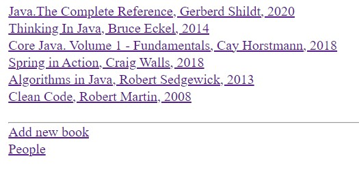

# Веб-приложение библиотеки
Использованные технологии

* Spring MVC, JDBC
* Hibernate6
* База данных (PostgreSql)
* Thymeleaf5

## Возможности приложения
* Добавлять, измененять и удалять человека
* Добавлять, измененять и удалять книгу
* Выводить страницу со списком всех людей (люди кликабельные - при клике осуществляется переход на страницу человека)
* Выводить страницу со списком всех книг (книги кликабельные - при клике осуществляется переход на страницу книги)
* Получать информацию о человеке и список книг, которые он взял
* Получать информацию о книге и имя человека, который взял эту книгу
* Назначать книгу человеку при ее аренде и освобождать при возврате
* Валидация полей, введенных пользователем

## Скриншоты
### Страница со списком всех людей

### Страницы для работы с человеком
Страница добавления человека      |  Страница изменения человека
:------------------------:|:-------------------------:
    |  

### Валидация полей

### Страница человека
Страница человека, не взявшего книги      |  Страница человека, после взятия книги
:------------------------:|:-------------------------:
    |  

### Страница со списком всех книг

### Страницы для работы с книгой
Страница добавления книги      |  Страница изменения книги
:------------------------:|:-------------------------:
    |  

### Страница книги
Страница свободной книги      |  Страница занятой книги
:------------------------:|:-------------------------:
    |  
